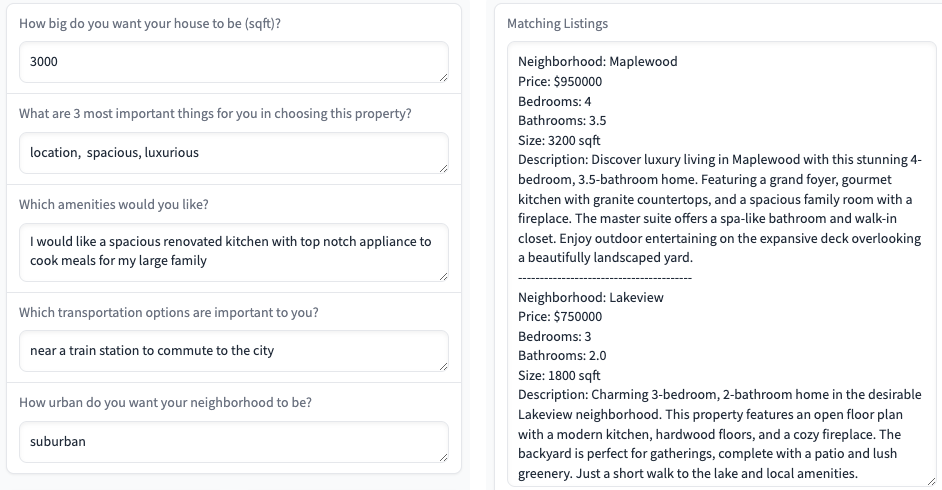
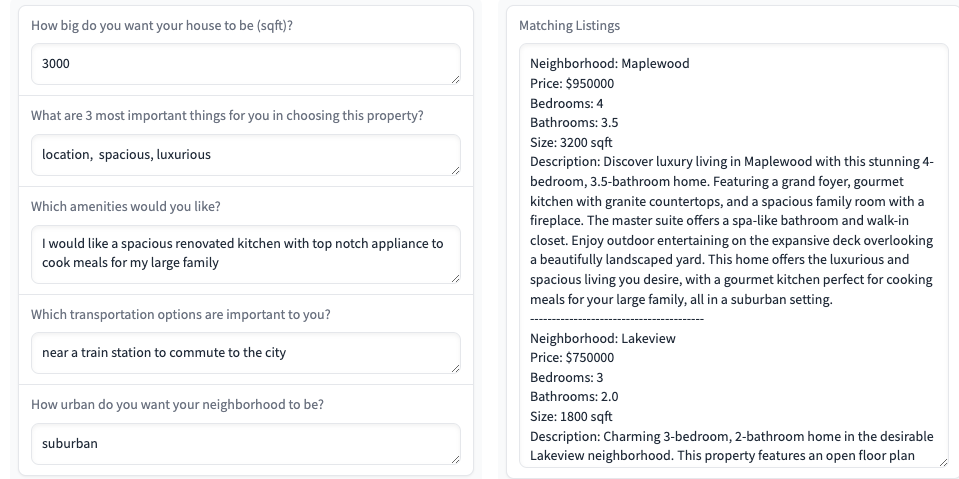

# HomeMatch AI Project

An AI-powered real estate listing matcher that provides personalized property recommendations based on user preferences.

## Installation

1. Set up Python environment with pyenv
```bash
pyenv install $(cat .python-version)
pyenv local $(cat .python-version)
```

2. Create a virtual environment
```bash
python -m venv venv
source venv/bin/activate
```

3. Install dependencies
```bash
pip install -r requirements.txt
```

4. Launch Jupyter Notebook
```bash
jupyter notebook
```

5. Open `HomeMatch.ipynb` in your browser

## What it does

HomeMatch AI helps match users with real estate listings based on their preferences:

- Generates sample real estate listings using GPT-4
- Stores listings in a vector database (ChromaDB) 
- Provides two interfaces for searching listings:
  1. Basic matching using semantic search
  2. Personalized matching that customizes descriptions

### Basic vs Personalized Matching

The key difference between the two interfaces is in how the listings are presented:

- Both use the same semantic search to find relevant properties based on user preferences
- The search results (properties shown) are identical between both interfaces
- The personalized interface enhances the descriptions to highlight aspects matching user preferences

For example:
- Basic: "A cozy 2-bedroom home with modern updates..."


- Personalized: "Perfect for your desired urban lifestyle, this cozy 2-bedroom home is just steps from public transit..."


The personalization focuses on emphasizing features that align with the user's stated preferences while maintaining factual accuracy about the property.

To compare the differences:
1. Enter the same preferences in both interfaces
2. Notice how the properties shown are the same
3. Compare the descriptions to see how they've been tailored in the personalized version

## Usage

Enter your preferences in the interface:
- Desired house size
- Top 3 priorities
- Preferred amenities  
- Transportation needs
- Desired level of urbanity

The system will return the top 5 matching listings based on these criteria.
